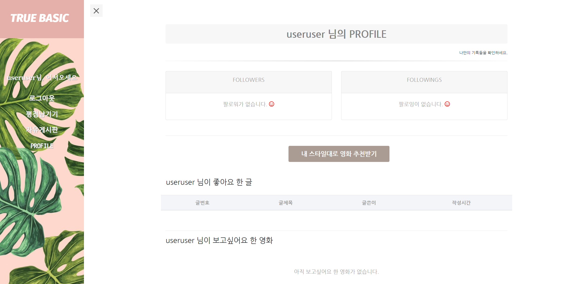
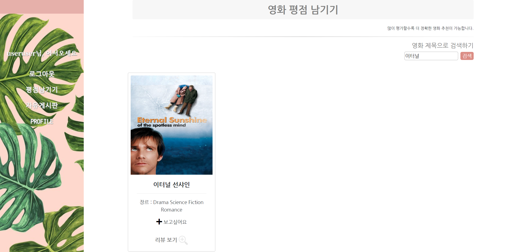

## 프로젝트 전반

### 프로젝트 목표: 영화 정보 전달, 공유 웹 서비스 구현

```
서비스 주요 기능
- 관리자만이 영화 추가 및 삭제 가능
- 관리자는 모든 게시글 및 한줄평 삭제 가능
- 일정 이상의 영화 데이터 보유
- 로그인 후 영화들에 평점을 등록, 수정, 삭제 가능
- 매긴 평점 들을 통해 다른 영화들을 추천 받는 기능
- 영화들에 대해 글을 게재, 수정, 삭제할 수 있는 게시판 기능
- Ajax 사용한 비동기 요청을 통해 좋아요, 보고싶어요 등의 기능
- 관련 API를 활용하여 일별 박스오피스 정보와 예고편 정보 전달
```


### ERD 


- 계정 관련 모델

	```python
  class User(AbstractUser):
      # 나를 팔로우 하는 사람 followers
      followers = models.ManyToManyField(
          settings.AUTH_USER_MODEL,
          related_name='followings')
	```


- 게시판 관련 모델

	```python
  class Article(models.Model):
      title = models.CharField(max_length=100)
      content = models.TextField()
      created_at = models.DateTimeField(auto_now_add=True)
      updated_at = models.DateTimeField(auto_now=True)
      movie = models.ForeignKey(Movie, on_delete=models.CASCADE)
      user = models.ForeignKey(settings.AUTH_USER_MODEL, on_delete=models.CASCADE)
      article_like_users = models.ManyToManyField(settings.AUTH_USER_MODEL, related_name='like_articles')
	```

	```python
  class Comment(models.Model):
      content = models.CharField(max_length=200)
      created_at = models.DateTimeField(auto_now_add=True)
      updated_at = models.DateTimeField(auto_now=True)
      article = models.ForeignKey(Article, on_delete=models.CASCADE)
      user = models.ForeignKey(settings.AUTH_USER_MODEL, on_delete=models.CASCADE)
      comment_like_users = models.ManyToManyField(settings.AUTH_USER_MODEL, related_name='like_comments')
	```


- 영화 관련 모델

	```python
  class Genre(models.Model):
      name = models.CharField(max_length=30)
      def __str__(self):
          return str(self.name)

  class Movie(models.Model):
      title = models.CharField(max_length=100)
      original_title = models.CharField(max_length=100)
      release_date = models.DateField(null=True)
      popularity = models.FloatField(null=True)
      vote_count = models.IntegerField(null=True)
      vote_average = models.FloatField(null=True)
      adult = models.BooleanField(null=True)
      overview = models.TextField(null=True)
      original_language = models.CharField(max_length=100, null=True)
      poster_path = models.CharField(max_length = 100)
      backdrop_path = models.CharField(max_length = 100, null=True)
      genres = models.ManyToManyField(Genre, related_name='movie_genres')
      like_users = models.ManyToManyField(settings.AUTH_USER_MODEL,
                      related_name='like_movies')
      def __str__(self):
          return str(self.title)
	```

	```python
  class Rating(models.Model):
      movie = models.ForeignKey(Movie, on_delete=models.CASCADE)
      user = models.ForeignKey(settings.AUTH_USER_MODEL, on_delete=models.CASCADE)
      ratings = models.PositiveIntegerField(default=10, validators=[MinValueValidator(1), MaxValueValidator(10)])
      content = models.TextField()
	```


## 프로젝트 상세

### 프로젝트 기반

##### 사용된 프레임워크 : Django(웹 전반), Bootstrap(웹 디자인 일부), Vue(기능 일부)

##### 사용된 api :  영화진흥위원회 일별 박스오피스 API, Youtube API

##### 사용된 라이브러리:  Axios


### 구현된 기능

#### 1. 사이트 전반

1-1. 메인 페이지


   - 로그인 없이 일별 박스오피스 영화 정보 날짜로 검색 가능

     - 사용된 API :  영화진흥위원회 일별 박스오피스 API
     - 사용된 프레임워크 : Vue.js
     - 사용된 라이브러리 : Axios


1-2. 네비게이션 바 & 반응형 페이지


   - 반응형 웹 페이지를 목표로 네비게이션 바에 토글 스위치 적용

   - 웹 사이트의 모든 페이지가 반응형

     - 사용된 프레임워크 :  Bootstrap(Container)


#### 2. 계정 관련 페이지

2-1. 회원가입 & 로그인


   - 회원가입, 로그인 페이지 구현
     - 사용된 프레임워크 :  Bootstrap(Form)


2-2. Profile(유저 본인의 프로필, 타 유저의 프로필)



- 유저 본인이 follow 하고 있는 유저 수와, 유저 본인을 follow 하는 유저 수 표시

- 영화 추천 페이지로의 이동 기능

- 유저가 좋아요 한 게시글 목록

- 유저가 보고싶어요 버튼 눌러 놓은 영화 목록


- 게시판과 평점 페이지에서 작성자 이름 클릭 시, 다른 유저의 프로필 페이지 보기 기능
- 유저 follow 기능, 추천영화 기능 등, 유저 본인의 프로필과 구성 상이
- 해당 유저 follow 버튼 클릭 시, 페이지 렌더링 후 follower 수와 팔로잉 아이콘 변화


#### 3. 게시판 관련 페이지

3-1. 게시글 리스트


- 테이블로 전체 게시글 리스트 나열
  - 사용된 프레임워크 :  Bootstrap(Form)
- 글 제목 클릭 시, 상세 페이지로 이동
- 글쓴이 이름 클릭 시, 작성자 프로필 페이지로 이동
- 좋아요 클릭시 페이지 렌더링 없이 아이콘과 카운트 변화
  - 사용된 라이브러리 : Axios
- 글쓰기 페이지로 이동 버튼


3-2.  게시글 검색


- 게시글과 관련된 영화 제목을 기준으로 검색 기능


3-3. 게시글 작성


- 게시글 작성 페이지
  - 사용된 프레임워크 :  Bootstrap(Form)
- 글의 내용과 관련 있는 영화를 선택


3-4. 게시글 상세


- 유저 본인이 쓴 게시글만 수정/삭제가 가능
- 유저 이름을 클릭하면 프로필 페이지로 이동
- 댓글 목록과 댓글 등록 기능
  - 사용된 프레임워크 :  Bootstrap(Form)
- 좋아요 클릭시 페이지 렌더링 없이 아이콘과 카운트 변화
  - 사용된 라이브러리 : Axios


- 댓글 쓴 유저 본인만 수정/삭제 가능


3-5. 댓글 수정


- 댓글 수정 기능
  - 사용된 프레임워크 :  Bootstrap(Form)


#### 4. 영화 관련 페이지

4-1.  영화 리스트


- 카드 내부에는 각 영화 제목, 장르, 보고싶어요 저장 버튼, 리뷰 보기 기능

  - 사용된 프레임워크 :  Bootstrap(Card)

- 보고싶어요 버튼은 클릭 시 페이지 렌더링 없이 색 변경

  - 사용된 라이브러리 : Axios


- 영화 리스트 페이지 하단에는 Pagination 적용
  - 사용된 프레임워크 :  Bootstrap(Pagination)


4-2.  영화 검색 기능



- 영화 제목으로 영화 검색


4-3.  영화 상세페이지


- 영화 제목, 포스터, 줄거리 등 상세 정보
- 예고편 보기 기능 버튼


- 영화에 대한 평가 목록
- 해당 영화의 모든 평점의 평균 점수 산출


4-4.  영화 한줄평 남기기


- 한줄평 등록 기능
  - 사용된 프레임워크 :  Bootstrap(Form)
- 모든 평점은 0~10 사이의 숫자여야 입력 가능(모델 참조)


- 이미 한번 평점을 남겼으면 중복 작성 불가


4-5. 예고편 보기 기능


- 영화 상세페이지에서 예고편 보기 버튼 클릭 시 영화 예고편 보기 기능

  - 사용된 라이브러리 :  axios
  - 사용된 API :  Youtube API


4-6. 영화 추천 페이지


- 유저 본인의 프로필에서 영화 추천받기 버튼으로 이동
- 유저가 평점을 높게 준 영화 순대로 20개 이하 나열


- 유저가 평점을 높게 준 영화들이 가장 많이 가지고 있는 장르 top3 추출
-  해당 장르를 모두 가지고 있는 영화가 1순위, 앞의 두가지 장르만 가지고 있는 영화가 2순위, 한 가지 장르만 가지고 있는 영화가 3순위로, 총 8개의 추천 영화 나열


#### 5. 관리자 페이지 기능

5-1. 게시물 관리

- 관리자는 관리자 전용 네비게이션 바에서, 게시물 관리 기능으로 접근 가능
- 모든 유저가 남긴 게시글의 수정, 삭제 가능


1-2. 영화 관리

- 관리자는 관리자 전용 네비게이션 바에서, 영화 관리 페이지로 접근 가능
- 유저 페이지와 마찬가지로 영화 제목으로 검색 가능

- 영화 등록을 눌러 새로운 영화 데이터 등록, 기존의 영화 데이터 수정 기능
  - 사용된 프레임워크 :  Bootstrap(Form)

- 게시물관리와 마찬가지로 영화 데이터의 유저가 쓴 한줄평 관리와 영화데이터 관리 기능


## 프로젝트 정리 및 마무리

### 구현에 어려움을 겪은 부분

####  1. 사이트 기능 관련

1-1. 추천 알고리즘

- 모델 빌딩 :  User 모델과 Movie 모델이 ManyToMany 관계로 연결되어야 함은 맞지만, 그런 경우 유저가 각 영화에 줄 평점을 테이블 상에서 어떻게 정의해야 할지 알 수 없었음.  따라서 기존에 배웠던 ManyToManyField를 사용하지 않고 Rating이라는 제 3의 테이블을 만들어 Movie와 User 두 테이블의 외래키와 평점, 한줄평 필드 생성

- 부모의 부모 테이블 데이터에 접근 :  영화 추천을 장르 기반으로 했기 때문에, 사용자 평점 테이블에서 영화 데이터에 접근하고, 이후  장르 테이블에 접근해야 했음.  views.py 파일에서 for문을 통해 쿼리에 접근하여 문제 해결

- 외래키 필드 기준 필터링:  사용자가 어떤 영화를 이미 평가 했다면 해당 영화는 다시 추천받아서는 안되는데, 이때 외래키를 기준으로 테이블을 필터링 하였음. (if movie not in Movie.objects.filter(rating__user=person))


1-2. 페이지 렌더링과 리다이렉트(메세지, 보고싶어요 등)

- 메세지 : 같은 유저가 평점을 두 번 이상 남기려 할 때 메세지를 주었는데, 이때 페이지가 redirect 되면 메세지 뜨지 않아  render로 수정하여 해결


#### 2. API 관련

2-1. C9에서의 Vue 컴포넌트 데이터 형식 :  서버에서 Vue 컴포넌트를 사용하여 데이터를 출력하기 위해서 delimiters: ['[[', ']]'] 입력

2-2. 요청 주소 파라미터 지정: API 요청 시 요청 주소 파라미터 값을 지정 하는 부분


#### 3. 데이터 관련

3-1. 포스터 데이터 :  보다 데이터가 많은 영화 파일을 찾아 테이블에 넣었지만 포스터 url 부재로 결국 기존의 데이터 사용


#### 4. 보안 관련

4-1. 숨김 처리 한 데이터 받아오기: .env 파일에 숨겨 놓은 데이터를 views.py 에서 os.environ.get('API_KEY') 형식으로 받아오고, 이를 템플릿에서 받아 해결


### 완성하지 못한 기능

- 댓글 좋아요 원래 하려함(좋아요 순대로 출력 하는 경우 등)

- 게시글을 대상 영화 기준으로 리스트 만들기

- 영화 추천 시 추천 영화의 예상 평점도 고려(유저의 취향과 해당 영화의 평점도 고려하여)

- 박스오피스 포스터 불러오기

- 관리자 페이지에서 게시물 여러개 체크박스로 선택 후 삭제하기 기능 구현

- 로딩페이지 추가


